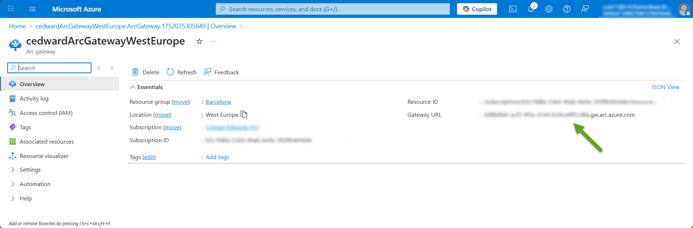
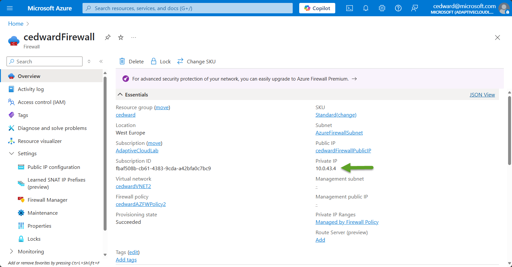
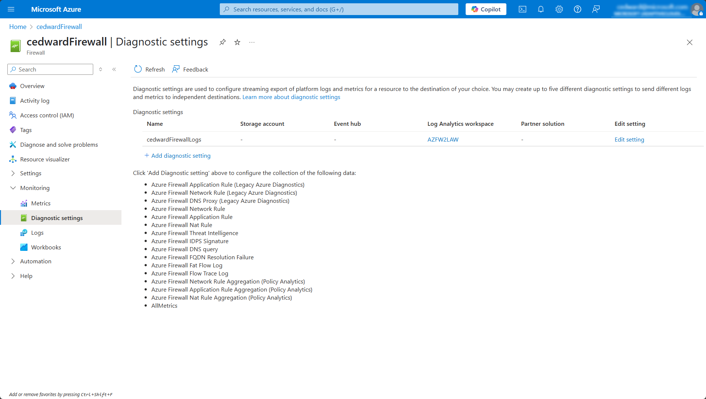

# Azure Local private path architecture Deep Dive

## Overview

If you want to use Azure Local without exposing your on-premises environment to the public internet, you can use the Arc gateway and the Azure Firewall Explicit Proxy feature to route all Azure Local traffic securely through your private connection (ExpressRoute or Site-to-Site VPN) to Azure.

This article covers the following topics:

- Required components for Azure Local private path.
- Outbound Network flows in Azure Local private path.
- How to configure the Azure Local Private Path architecture.

#### Key Benefits

- **Better Security:** Keep Azure Local traffic within your On-premises network and Azure using Express Route or S2S VPNs.
- **Easier Setup:** Leverage your existing network and security infrastructure while the Arc gateway manages Azure connectivity.
- **Simpler Management:** Fewer endpoints to manage means easier tracking and troubleshooting.

This guide explains how outbound connections work with the Arc gateway and Azure Local, including detailed diagrams and configuration requirements.

#### Prerequisites and Network Requirements

- An existing Azure VNET without Azure Arc Private Link Scope enabled. (Note: Other Private Link services, such as Azure Key Vault or Azure Storage, can still be enabled.)
- An existing Azure ExpressRoute or Site-to-Site VPN connection from the on-premises environment to the Azure VNET.
- An Azure Firewall instance configured on the VNET without Azure Arc Private Link scope enabled.
- Network routing configured to allow Azure Local nodes to connect to the Azure VNET and subnets over ExpressRoute or S2S VPN.
- An Azure Arc gateway resource within the same subscription where Azure Local nodes are being registered.
- Azure Local version 2506 or later. Previous releases do not support private path architecture.

#### Restrictions and limitations

- This solution uses Azure Firewall Explicit Proxy as a forward proxy. Azure Local does not support TLS inspection on the required endpoints.
- TLS certificates can't be applied to the Azure Firewall Explicit Proxy.

---

## Required components for Azure Local private path

The following diagram introduces the core components involved in Azure Local private path:

- **Azure Local Instance:** Your on-premises Azure Local cluster.
  
- **Nodes:** Individual servers within your Azure Local instance.

- **Arc Proxy (on Arc connected machine agent):** A local proxy service running on each node, responsible for securely routing HTTPS traffic through the Arc gateway.

- **Arc Gateway Public Endpoint:** The Arc gateway resource must be created in the same Azure subscription as your Azure Local nodes. After creation, ensure the Arc gateway endpoint URL is explicitly allowed in your Azure Firewall Application Rules.

- **Enterprise Firewall:** Your organization's existing security infrastructure controlling outbound traffic.

- **Azure ExpressRoute:** The Express Route circuit is the communication path between the on-prem networks and Azure VNETs. Azure Local nodes traffic must be routed over express route to reach the Azure VNET. It is important to ensure that before Arc registration and enabling the Arc gateway, all nodes have network connectivity to the VNET and the subnets where Azure Firewall is running. All nodes must be able to reach the Azure Firewall private ip, as this will become the proxy endpoint for HTTP and HTTPS traffic from the nodes and the Arc proxy service.

- **Azure VNET:** Before deploying an Azure Firewall instance, an Azure VNET must be created with the corresponding subnets. At least one workloads subnet and one Azure Firewall subnet must be created. Azure Local does not support Azure Arc Private Link Scopes, and it is not supported to enable Azure Arc private link Scope on the VNET where Azure Firewall as explicit proxy is running. If Azure Arc for servers Private Link Scope is required for your workloads, a separate VNET with Azure Arc Private Link Scope configuration must be used.

- **Azure Firewall Explicit Proxy:** The Azure Firewall instance deployed on its own subnet should be configured as explicit proxy and the required Azure Local endpoints for Arc gateway scenarios should be allowed on the corresponding Azure Firewall policy Application Rules.

- **Azure Public Endpoints:** Azure services (e.g., Azure Resource Manager, Key Vault, Microsoft Graph) required by your local environment.


---

## Outbound Network flows in Azure Local private path

When using Azure Local private path, operating system (OS) and Arc Resource Bridge appliance VM network traffic is categorized based on how it should be routed. Clearly distinguishing these categories helps administrators correctly configure network routing rules, ensuring secure, efficient, and compliant connectivity between on-premises infrastructure and Azure services over Azure ExpressRoute or Site to Site VPNs.

### Traffic Categories

1. **🟦 OS HTTP and HTTPS traffic that must bypass Azure Firewall Explicit Proxy**
   Specific HTTP and HTTPS connections that should not pass through Azure Firewall Explicit Proxy. Instead, these connections directly reach their intended internal destinations, typically due to technical requirements or performance considerations. Private Link endpoints such as Key Vault or Storage accounts should be also added to the proxy bypass list if your organization requires their usage.

2. **🟨 OS HTTP traffic that cannot use Arc proxy and must be sent to Azure Firewall Explicit Proxy**  
   HTTP traffic is incompatible with the Arc proxy. This traffic must instead be routed through Azure Firewall Explicit Proxy, ensuring compliance with internal security policies.

3. **🟩 OS HTTPS traffic that always uses Arc proxy**  
   HTTPS traffic that must always be routed through the Arc proxy. This ensures secure, controlled, and consistent connectivity to Azure endpoints, leveraging the Arc gateway's built-in security and management capabilities. Make sure you allow all the endpoints required for Arc gateway in Azure Local listed here: [Azure Local Arc gateway required endpoints](https://learn.microsoft.com/en-us/azure/azure-local/deploy/deployment-azure-arc-gateway-overview?view=azloc-2505&tabs=portal#azure-local-endpoints-not-redirected)

4. **🟥 Third-party OS HTTPS traffic not permitted through Arc gateway**
   All HTTPS traffic from the operating system initially goes to the Arc proxy. However, the Arc gateway only permits connections to Microsoft-managed endpoints. This means that HTTPS traffic destined for third-party services—such as OEM endpoints, hardware vendor update services, or other third-party agents installed on your servers, cannot pass through the Arc gateway. Instead, this traffic is redirected to Azure Firewall Explicit Proxy. To ensure these third-party services function correctly, you must explicitly configure Azure firewall Explicit Proxy Application Rules to allow access to these external endpoints based on your organization's requirements.

5. **📘 Arc Resource Bridge VM and AKS Clusters using Azure Local Instance cluster IP as proxy**
   Azure Arc Resource Bridge is a Kubernetes-based management solution deployed as a virtual appliance (also called the Arc appliance) on your on-premises infrastructure. Its main purpose is to enable your local resources to appear and be managed as Azure resources through Azure Resource Manager (ARM). To achieve this, the Arc Resource Bridge requires outbound connectivity to specific Azure endpoints. In an Azure Local environment, this outbound traffic is routed through the Cluster IP as proxy, which then securely forwards the traffic through the Arc gateway tunnel established by your Azure Local nodes. This approach simplifies network configuration, enhances security, and ensures compliance with your organization's network policies.
   Also, when deploying AKS cluster in Azure Local, by default the control plane VM and the pods will also use the Cluster IP as proxy to send the outbound traffic through the Arc gateway. However, for some services running inside your AKS clusters you might also need to allow additional endpoints that will be send directly to your firewall. 


## Traffic Flow Scenarios

### 1. Azure Local private path Node OS traffic bypassing Azure Firewall Explicit Proxy

This diagram illustrates traffic from Azure Local nodes that bypasses the Arc proxy entirely. Typical scenarios include:

- Internal communications within your local intranet.
- Node-to-node communications within the Azure Local cluster.
- Traffic destined for internal management or monitoring systems.
- Traffic destined for Private Link endpoints such as Key Vaults or Storage Accounts.

This traffic is sent directly to these endpoints without passing through the Arc gateway or Azure Firewall Explicit Proxy, ensuring low latency and efficient internal communication.

When defining your proxy bypass string for your Arc initialization script or when using the Companion App make sure your meet the following conditions:

- At least the IP address of each Azure Local machine.
- At least the IP address of the Cluster.
- At least the IPs you defined for your infrastructure network. Arc Resource Bridge, AKS, and future infrastructure services using these IPs require outbound connectivity.
- Or you can bypass the entire infrastructure subnet.
- NetBIOS name of each machine.
- NetBIOS name of the Cluster.
- Domain name or domain name with asterisk * wildcard at the beginning to include any host or subdomain.  For example, 192.168.1.* for subnets or *.contoso.com for domain names.
- Parameters must be separated with comma ,.
- CIDR notation to bypass subnets isn't supported.
- The use of <local> strings isn't supported in the proxy bypass list.


---

### 2. Azure Local private path Node OS HTTP Traffic via Azure Firewall Explicit Proxy

This diagram shows how standard HTTP (non-HTTPS) traffic from Azure Local nodes is managed:

- HTTP traffic routes through Azure Firewall Explicit Proxy. Make sure you don't use a .local domain as your proxy server name. For example it is not supported to use proxy.local:8080 as proxy server. Use the proxy server IP instead if your proxy belongs to a .local domain.
- Make sure required endpoints for Azure Local are allowed in your enterprise firewall and in Azure Firewall Explicit Proxy, where your organization's security policies determine whether the traffic is allowed or blocked.

This ensures standard HTTP traffic aligns with your existing security infrastructure.


---

### 3. Azure Local Node OS HTTPS Traffic via Arc Proxy

This diagram explains how HTTPS traffic from Azure Local nodes is securely routed:

- HTTPS traffic destined for allowed Azure endpoints routes through the Arc proxy running on each node. Make sure you allowed your Arc gateway URL in your proxy and/or firewall.
- The Arc proxy establishes a secure HTTPS tunnel to the Arc gateway public endpoint hosted in Azure.
- Traffic not allowed by the Arc proxy (non-approved endpoints) is redirected to Azure Firewall Explicit Proxy for further inspection or blocking. Make sure you allow the required 3rd party HTTPS endpoints for Azure Local such as the OEM SBE endpoints in Azure Firewall Explicit Proxy using the corresponding Application Rules.

This ensures secure, controlled, and compliant outbound HTTPS connectivity.


---

### 4. Azure Resource Bridge Appliance VM HTTPS Traffic via Cluster IP Proxy

This diagram illustrates HTTPS traffic handling for the Azure Resource Bridge (ARB) appliance VM:

- ARB appliance VM sends HTTPS traffic through a Cluster IP proxy.
- The Cluster IP proxy securely routes allowed traffic through the Arc gateway's HTTPS tunnel to Azure.
- Non-allowed traffic is redirected to your firewall/proxy for security enforcement.

This ensures ARB appliance VM traffic is securely managed and compliant with your organization's policies.


---

### 5. AKS Clusters HTTPS Traffic via Cluster IP Proxy

This diagram shows HTTPS traffic handling for Azure Kubernetes Service (AKS) clusters within Azure Local:

- AKS clusters route HTTPS traffic through the Cluster IP proxy.
- The Cluster IP proxy securely forwards allowed traffic through the Arc gateway's HTTPS tunnel to Azure endpoints.
- Traffic not permitted by the Arc gateway is sent to your firewall/proxy for further security checks.

This ensures AKS clusters maintain secure and compliant outbound connectivity.


---

### 6. Azure Local VMs HTTPS Traffic via Dedicated Arc Proxy

This diagram explains HTTPS traffic handling for Azure Local virtual machines (VMs):

- Each Azure Local VM uses its own dedicated Arc proxy to route HTTPS traffic.
- Allowed HTTPS traffic is securely tunneled through the Arc gateway to Azure public endpoints.
- Non-allowed traffic is redirected to Azure Firewall Explicit Proxy for security enforcement.

This ensures Azure Local VMs have secure, controlled, and compliant outbound connectivity.


---

## How to configure Azure Local private path

### Step 1 - Create the Arc gateway resource in your subscription

The first step we must complete to enable the Azure Local private path Arc is to create the Arc gateway resource in our Azure subscription.
#### Create the Arc gateway resource in Azure

1. Sign in to Azure portal.
2. Go to the Azure Arc > Azure Arc gateway page, then select Create.
3. Select the subscription and resource group where you want the Arc gateway resource to be managed within Azure. An Arc gateway resource can be used by any Arc-enabled resource in the same Azure tenant.
4. For Name, enter the name for the Arc gateway resource.
5. For Location, enter the region where the Arc gateway resource should live. An Arc gateway resource can be used by any Arc-enabled resource in the same Azure tenant.
6. Select Next.
7. On the Tags page, specify one or more custom tags to support your standards.
8. Select Review & Create.
9. Review your details, and then select Create.
The gateway creation process takes nine to ten minutes to complete.
Once the Arc gateway is created, the URL gets assigned. Take note of this URL because you will need to allow HTTPS traffic to this endpoint in your Azure Firewall application rules.



You can also create an Arc gateway resource using Azure CLI, or Azure PowerShell. Please refer to the the Azure Local Arc gateway documentation if using the Azure Portal to create the Arc gateway is not an option. [Overview of Azure Arc gateway for Azure Local](https://learn.microsoft.com/en-us/azure/azure-local/deploy/deployment-azure-arc-gateway-overview?view=azloc-24112&tabs=portal#create-the-arc-gateway-resource-in-azure)

### Step 2 - Create the Azure Firewall instance in your Azure VNET without Azure Arc Private Link Scope Enabled.

#### Prerequisites

To deploy an Azure Firewall instance into an existing virtual network, you need a subnet called AzureFirewallSubnet.

1. In the Azure portal, navigate to the **virtual network** where you plan to deploy your Azure Firewall instance.
2. From the left navigation, select **Subnets > + Subnet**.
3. In **Name**, type AzureFirewallSubnet.
4. **Subnet address range**, accept the default or specify a range that's at least /26 in size.
5. Select **Save**.

#### Deploy the Azure Firewall instance and get its private IP

1. On the Azure portal menu or from the Home page, select **Create a resource**.
2. Type firewall in the search box and press **Enter**.
3. Select **Firewall** and then select **Create**.
4. On the **Create a Firewall** page, configure the firewall as shown in the following table:

|Setting|Value|
|-------|-----|
|Resource Group|Same Resource Group as of the selected Virtual Network|
|Name|Name of your choice|
|Region|Same region as the selected Virtual Network|
|Availability zone|Select your availability zone option|
|Virtual network|Select the integrated virtual network|
|Public IP Address|Select an existing address or create one by selecting **“Add new”**|
|Firewall tier|Select **Standard** or **Premium** tier to support Explicit Proxy feature|
|Firewall management|Select **“Use a Firewall Policy to manage this firewall”**|
|Firewall policy|Create one by selecting **"Add new"**|
|Firewall management NIC|Leave this option unselected|


5. Click **Review + create**
6. Select **Create** again. This will take a few minutes to deploy.
7. After deployment is completed, go to your resource group, and select the firewall.
8. In the firewall's Overview page, copy private IP address. The private IP address will be used as next hop address in the routing rule for the virtual network and it will also be used as Azure Local machines proxy.



### Step 3 - Enable Explicit proxy feature

1. Navigate to your Azure Firewall resource, then go to the **Firewall Policy**.
2. In **Settings**, navigate to the **Explicit Proxy (Preview)** pane.
3. Select **Enable Explicit Proxy.**
4. Enter the desired TCP port for both HTTP and HTTPS traffic.
5. Select Apply to save the changes.

#### Configure the Azure Firewall policies

Outbound traffic from your On-prem network is now routed through the integrated virtual network to the firewall. To control outbound traffic, add an application rule to firewall policy.

1. Navigate to the applicable firewall policy.
2. In **Settings**, navigate to the **Application Rules** pane.
3. Select **Add** a rule collection.
4. Provide a **Name** for the rule collection.
5. Set the **Rule collection type to Application**
6. Set the rule **Priority** based on other rules you may have.
7. Set the **Rule collection type to Allow**.
8. Select the **Rule collection group** where you want to include your rules.
9. Set the **Name** of your rule.
10. For the **Source**, enter “*”, or any source IPs you may have.
11. Set **Protocol** as http:80,https:443.
12. Set **Destination Type** to FQDN
13. Set **Destination** as a comma-separated list of URLs required for your scenario.
14. Select **Add** to save the rule collection and rule.

> **⚠️ Important Note:**  
> For details on required URLs, see [Azure Local Arc gateway required endpoints](https://learn.microsoft.com/en-us/azure/azure-local/deploy/deployment-azure-arc-gateway-overview?view=azloc-2505&tabs=portal#azure-local-endpoints-not-redirected), or use the list of endpoints provided in the table below.  
>
> The following is an example of how the destination string should be formatted if you choose to use a single rule to include all endpoints. Alternatively, you can create separate rules for each endpoint:
>
> ```
> aka.ms,azurestackreleases.download.prss.microsoft.com,login.microsoftonline.com,<region>.login.microsoft.com,management.azure.com,gbl.his.arc.azure.com,<region>.his.arc.azure.com,dc.services.visualstudio.com,<region>.obo.arc.azure.com,<yourarcgatewayId>.gw.arc.azure.com,<yourkeyvaultname>.vault.azure.net,<yourblobstorageforcloudwitnessname>.blob.core.windows.net,ocsp.digicert.com,s.symcd.com,ts-ocsp.ws.symantec.com,ocsp.globalsign.com,ocsp2.globalsign.com,oneocsp.microsoft.com,crl.microsoft.com,dl.delivery.mp.microsoft.com,*.tlu.dl.delivery.mp.microsoft.com,*.windowsupdate.com,*.windowsupdate.microsoft.com,*.update.microsoft.com
> ```


### Step 4 - Bootstrap and Arc registration of your nodes via private path

Once Arc gateway is created, Azure Firewall Explicit Proxy is configured and Azure ExpressRoute routing is completed on the Azure side, it is time to set up your Azure Local nodes to work on this private path scenario. You can register each of your nodes using the Arc initialization script or the Companion App. Regardless of the method you use for the nodes Arc registration, make sure you include the Arc gateway Id, the Azure Firewall internal IP and port as proxy server and the proxy bypass list for the traffic you don't want to send over proxy.

#### Example of Azure Local private path Arc registration using Configurator App


#### ⚠️ Important proxy bypass list string considerations
>
> - Use "localhost" instead of "<<local>local>" 
> - Use specific IPs such as 127.0.0.1 without mask 
> - Use * for subnets allowlisting. 192.168.1.* for /24 exclusions. Use 192.168.*.* for /16 exclusions.
> - Append * before domain names like *.contoso.com to bypass a an entire domain. 
> - DO NOT INCLUDE .svc on the list. The registration script takes care of Environment Variables configuration.


#### ⚠️ Make sure you add the Arc gateway Id information as part of the Azure Arc agent setup.

#### Example of Azure Local private path Arc registration using Arc initialization script during bootstrap.


```azurepowershell
#Define the subscription where you want to register your server as an Arc device
$Subscription = "yoursubscriptionid"

#Define the resource group where you want to register your server as an Arc device
$RG = "yourresourcegroup"

#Define the tenant ID used to register your server as an Arc device
$Tenant = "yourtenantid"

#Define your proxy server if required (Azure Firewall internal IP and port)
$ProxyServer = "http://azurefirewallinternalIP:port"

#Define the Arc gateway resource ID from Azure
$ArcgwId = "yourArcgwid"

#Define the bypass list for the proxy. Use comma to separate each item from the list

$ProxyBypassList = "*.contoso.com,node1,node2,node3,node4,node5,192.168.1.*,192.168.2.*,HCICabrils1,HCICabrils2,HCICabrils3,HCICabrils4,HCICabrils5"

# Invoke Arc initialization for Azure Local nodes
Invoke-AzStackHciArcInitialization -SubscriptionID $Subscription -ResourceGroup $RG -TenantID $tenant -Region "<yourregion>" -Cloud "AzureCloud" -Proxy $ProxyServer -ProxyBypass $ProxyBypassList -ArcGatewayID $ArcgwId
```

#### ⚠️ Important proxy bypass list string considerations
>
> - Use "localhost" instead of "<<local>local>" 
> - Use specific IPs such as 127.0.0.1 without mask 
> - Use * for subnets allowlisting. 192.168.1.* for /24 exclusions. Use 192.168.*.* for /16 exclusions.
> - Append * before domain names like *.contoso.com to bypass a an entire domain. 
> - DO NOT INCLUDE .svc on the list. The registration script takes care of Environment Variables configuration.

### Step 5 - Validate that proxy configuration on the OS and the Arc agent is ready for Azure Firewall and Arc gateway after Arc registration is completed

To ensure that private path traffic from On-prem Azure Local machines to Azure Firewall and Arc gateway is properly configured you need to ensure that WinInet, WinHTTP, Environment Variables and Arc agent has the right proxy configuration.

#### To validate WinHTTP proxy configuration run the following command on your Azure Local machine


- Make sure that on the Proxy Servers configuration the HTTP proxy is set to you Azure Firewall HTTP endpoint. For example, http://10.0.43.4:8080
  
- Make sure that on the Proxy Servers configuration the HTTPS proxy is set to use http://localhost:40343. This is the Arc proxy service from the Arc agent responsible for creating the tunneling with Arc gateway in Azure.
  
-  Review that the ProxyBypass string is properly configured, where each parameters must be separated with semicolon, subnets exclusions use * as wildcard and domain names uses * at the beginning of the name. This notation is specific for WinHTTP and WinINET proxy bypass string configuration

#### To validate WinINET proxy configuration run the following command on your Azure Local machine


- Make sure that on the Proxy Servers configuration the HTTP proxy is set to you Azure Firewall HTTP endpoint. For example, http://10.0.43.4:8080
  
- Make sure that on the Proxy Servers configuration the HTTPS proxy is set to use http://localhost:40343. This is the Arc proxy service from the Arc agent responsible for creating the tunneling with Arc gateway in Azure.

- Review that the ProxyBypass string is properly configured, where each parameters must be separated with semicolon, subnets exclusions use * as wildcard and domain names uses * at the beginning of the name. This notation is specific for WinHTTP and WinINET proxy bypass string configuration

#### To validate Environment Variables proxy configuration run the following command on your Azure Local machine


- Make sure that on the HTTP variable the proxy is set to you Azure Firewall HTTP endpoint. For example, http://10.0.43.4:8080

- Make sure that on the HTTPS variable the proxy is set to use http://localhost:40343. This is the Arc proxy service from the Arc agent responsible for creating the tunneling with Arc gateway in Azure.

- Review that the ProxyBypass string is properly configured. For environment variable is important to review that values are comma-separated, and wildcards are defined as “.” Preceding the value. For example, .contoso.com or .svc. Subnets exclusions must use CIDR notation instead of using * as wildcard.

#### To validate Azure Arc agent proxy configuration run the following command on your Azure Local machine


- Make sure that Using HTTPS Proxy value is set to the Arc proxy endpoint http://localhost:40343. This is the Arc proxy service from the Arc agent responsible for creating the tunneling with Arc gateway in Azure.

- Make sure that on the Upstream Proxy value is set to use your Azure Firewall HTTPS proxy endpoint. For example, http://10.0.43.4:8443. 

---

## Start Azure Local deployment

At this point, both the Azure side and the On-prem Azure Local Machines are ready to start the deployment over a private path. You can start the deployment following one of the two options available in public documentation.

1. Deploy from Azure Portal - Deploy an Azure Local instance using the Azure portal - Azure Local | Microsoft Learn

2.	Deploy using ARM templates - Azure Resource Manager template deployment for Azure Local, version 23H2 - Azure Local | Microsoft Learn


---

## Monitor outbound traffic on Azure Firewall

If you already have a Log Analytics workspace in your subscription where Azure Firewall is running, you can enable specific monitoring to track the Explicit proxy application rules.

1. Go to your Azure Firewall resource and under **Monitoring**, open the **Diagnostic settings**.

2. Click on + **add diagnostic setting**

3. On the diagnostic setting configuration page select at least the Azure Firewall Application Rule log. We also recommend selecting the Azure Firewall Network Rule and the Azure Firewall Flow trace log in case they are required for deeper monitoring and troubleshooting.

4. On the Destination details select to send to log Analytics workspace and select your subscription and your Log Analytics Workspace.

5. Select the Resource specific option for the Destination table and click save




Once the diagnostic settings are configured and after waiting few minutes, you can start monitoring your Azure Firewall Explicit Proxy traffic under the Logs section by using the AZFWApplicationRule query.

Note that most of your outbound traffic must be using your Arc gateway endpoint as Fqdn.


---
## Summary

This article provided a comprehensive overview of configuring Azure Local private path architecture using Azure Arc gateway and Azure Firewall Explicit Proxy. By routing Azure Local traffic securely through private connections such as ExpressRoute or Site-to-Site VPN, organizations can significantly enhance security, simplify network management, and reduce administrative overhead.

Key points covered include:

- **Architecture Components:** Understanding the core components required, including Azure Local nodes, Arc gateway, Azure Firewall Explicit Proxy, and Azure networking infrastructure.
- **Traffic Categorization:** Clearly distinguishing between different types of network traffic (internal, HTTP, HTTPS, third-party) and their appropriate routing paths.
- **Configuration Steps:** Detailed guidance on setting up Azure Firewall Explicit Proxy, creating firewall rules, registering Azure Local nodes via Arc gateway, and configuring proxy bypass lists.
- **Validation and Monitoring:** Instructions for validating proxy configurations across various system components and enabling monitoring through Azure Log Analytics for effective troubleshooting and compliance.

By following this structured approach, IT administrators can ensure secure, efficient, and compliant connectivity between their on-premises Azure Local environments and Azure services, while leveraging existing network infrastructure and security policies.