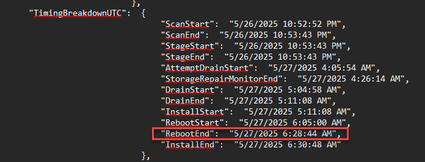

# Single-node env SBE update fails with SBE-CAU-RUNNING-AFTER-DONE

As part of installing a SBE update along with or after Azure Local version 2506, single-node SBE updates may fail with a `SBE-CAU-RUNNING-AFTER-DONE` error.

# Symptoms
Single-node environments may fail SBE update with a message similar to:
```
Type 'SBEPartnerConfirmCauDone' of Role 'SBE' raised an exception:

SBE_vendor_family_4.x.xxxx.xx: ErrorID: SBE-CAU-RUNNING-AFTER-DONE -- CAU run is still in progress when it should be done. See https://aka.ms/AzureLocal/SBE/CauHelp for help. Review full Get-CauRun output it identify if it is progressing or stuck. Wait for it to complete if progressing.

Stack Trace: at SBEPartnerConfirmCauDone, C:\NugetStore\Microsoft.AzureStack.Role.SBE.10.2506.1001.2018\content\Classes\SBE\SBE.psm1: line 2532
```

# Issue Validation
The `SBE-CAU-RUNNING-AFTER-DONE` exception can be reported for different reasons. To confirm you are experiencing the symptom described in this article confirm that each of the following is observed:
1. The error is seen on a single-node cluster
2. Immediately after the error is reported by the SBE update, `Get-CauRun` continues to report an in progress CAU run.
3. After the CAU run completes, the `Get-CauReport -Last -Detailed` output indicates a `TimingBreakdowUTC` entry where the exception was reported shortly after a RebootEnd time:


# Cause
The SBE Update action plan logic that monitors the CAU run can be interrupted on single-node clusters as part of CAU restarting the server.  This has been seen to occur 10-15% of the time on single-node clusters and is caused by Get-CauReport returning the `Unable to receive cluster object notifications: (Win32Exception) The cluster node is shutting down` for long enough prior to the node shutting down that the action plan orchestration notices that exception. If the action plan repeatedly sees this exception reported it maybe believe the CAU run has failed and record that information prior to the shutdown. Normally, the action plan monitoring of the CAU run would resume after the restart; however, if the action plan has already recorded a CAU run failure, it will be surprised to find that it is indeed still running after the node restarts.

`Get-CauRun` failing with this exception during the course of restart the server is normal behavior for single-node CAU runs because there is not a separate node for the CAU orchestrator to run from and because shutting down the node is shutting down the cluster.

# Mitigation Details
In many cases there will be no issue with the CAU run and it will be still running. In that successful case, the primary mitigation is to continue to let it run until it completes.

This same general guidance is provided in the exception message itself:
`Review full Get-CauRun output it identify if it is progressing or stuck. Wait for it to complete if progressing.`

More specific guidance for monitoring involves:
1. Regularly call `Get-CauRun` to check on status. Some SBE updates require up to 3 reboots to finish their firmware and driver updates so if the failure occurs on the 1st reboot your node may have 1 or 2 reboots left before ethe CAU run completes.
2. Once Get-CauRun reports something other than `RunInProgress` (e.g. it reports `RunNotInProgress`) check the output of following to confirm the CAU run was successful:
`Get-CauReport -Last -Detailed`
3. Confirm the report indicates `Success` and that it is the proper report (e.g. from the current update and not something than on an earlier date).
4. If everything was successful (as will be the case in most instances), you can resume your update via the normal process as described at [https://learn.microsoft.com/en-us/azure/azure-local/update/update-via-powershell-23h2#step-7-resume-the-update-if-needed](https://learn.microsoft.com/en-us/azure/azure-local/update/update-via-powershell-23h2#step-7-resume-the-update-if-needed)
 
### **Additional Notes**

*   There is still a chance that the CAU run will fail due after the node reboots for some other reason.  This will be observed by Get-CauRun reporting `RunFailed` or more often, by Get-CauReport indicating a failure.
*   Because the exception discussed in this guide is transient and does not actually impact the CAU run, **any error reported by Get-CauReport should be investigated first with appropriate action being taken to resolve that actual CAU run error.**
*   For help troubleshooting any additional CAU failures, consult your hardware vendor's known issue documentation or see https://aka.ms/AzureLocal/SBE/CauHelp for additional help
